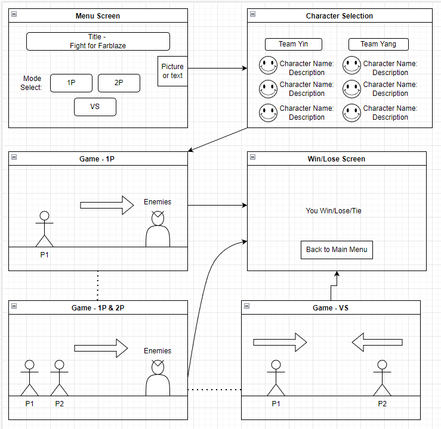

# Fight-for-Farblaze
Is a 2D multiplayer fighting game where you and your friend select your hero and battle enemies to save Farblaze! You can choose 1 player mode, 2 player mode, or versus??? mode (MAYBE). 

## Wire Frame

## Installation Instructions
Fork code from github and run the index.html file on chrome or play game from the link listed here: @todo add link

# Explanation of Technologies Used
In this project, I use HTML and CSS mainly for adding different elements, formatting the game, and styling the game. I use Javascript to run the game, add in additional elements that need to be introduced during the game, create and animate objects, and determine win conditions of the game.

### HTML
Put code snippets here

### CSS 
Put code snippets here

## JavaScript Functions and Rendering
Put code snippets here

## Rules

one player or two players start from the left and work their way to the end point, defeating all the enemies along the way.

attack the other player until one wins or the time runs out

### List of Assets Used
#### Background Image
Image Download: https://edermunizz.itch.io/free-pixel-art-forest
Creator: https://edermunizz.itch.io
#### Various Sprites
Image Download: https://brullov.itch.io/oak-woods
Creator: https://brullov.itch.io
### Dev Notes

4 Elements of game design - Challenge, Choice, Change, Chance

